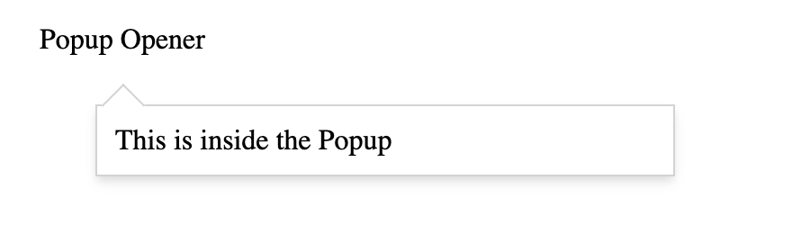

# `react-icon-popup`

A Tiny React Icon Popup. Its compatable with typescript.

## Demo



## How to Use

First install the package with npm

`$ npm i react-icon-popup --save`

Import IconPoup from the package.

```js
import IconPopup from "react-icon-popup";
import App from "./App.js";

function main() {
  return (
    <>
      <IconPopup
        popupTriggerer={<span>Icon to be clicked</span>}
        popupContent={
          <div
            onClick={() => {
              alert("popup clicked");
            }}
          >
            Content Inside the Popup
          </div>
        }
        onPopupTrigger={(...args) => {
          console.log(args);
        }}
        popupWidthInPx={100}
      />
    </>
  );
}
```

# API

## IconPopup

| Key                | Value Type       | Is Optional | Info                                                   |
| ------------------ | ---------------- | ----------- | ------------------------------------------------------ |
| popupContent       | React Element    | No          | will be rendered inside the popup                      |
| popupTriggerer     | React Element    | No          | will be rendered as popup opener/closer                |
| popupWidthInPx     | number           | No          | should specify the required width of the popup content |
| containerStyle     | object           | Yes         | same as react style object \*                          |
| arrowStyle         | object           | Yes         | same as react style object \*                          |
| popupStyle         | object           | Yes         | same as react style object \*                          |
| onPopupTrigger     | (isOpened,event) | Yes         | will called when popup opens or closes                 |
| popupMaxHeightInPx | number           | Yes         | can specify mini height for the popup content          |

\* - some position css attributes will be removed

#### Raising Issues and PRs are heartly welcomed.

##### with :heart: by [Akash Basavaraju](https://github.com/akash-basavaraju)
